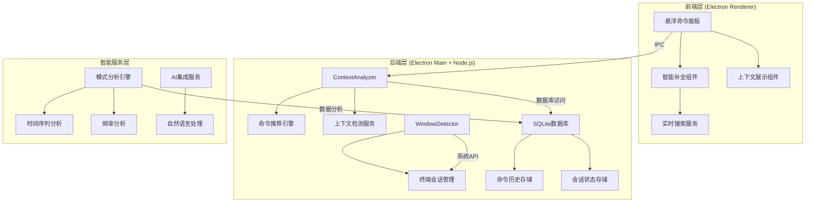
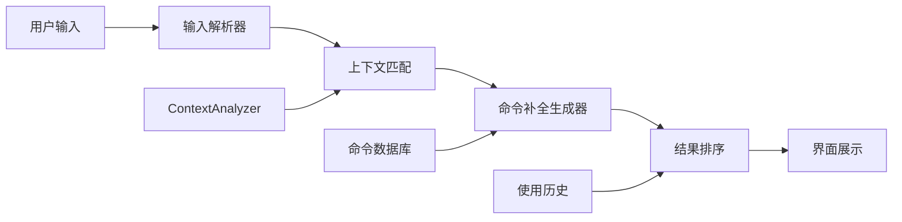
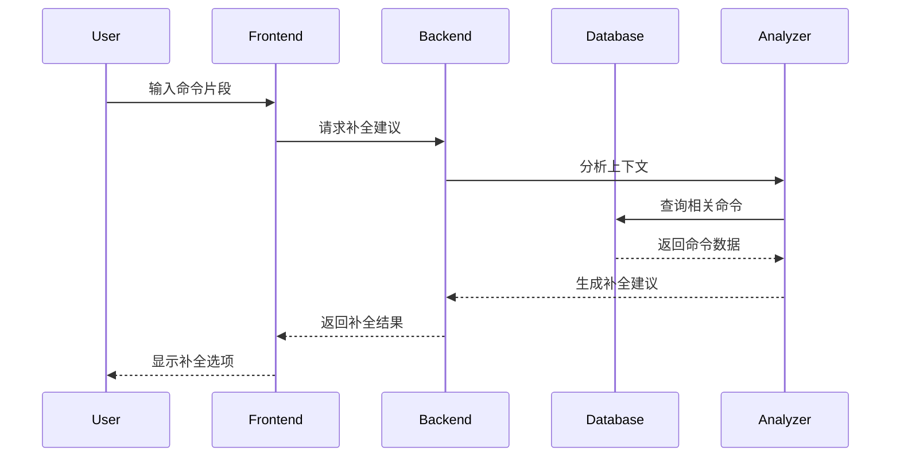
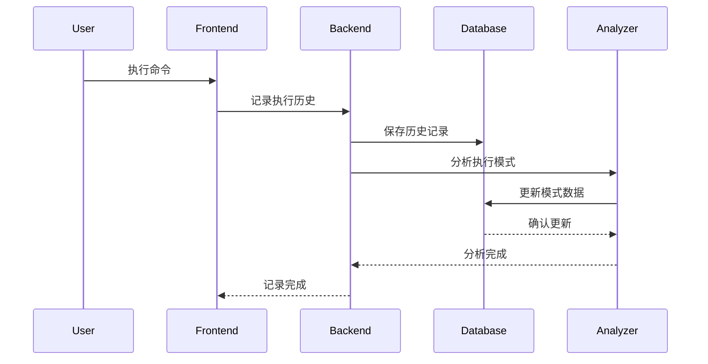

# 🏗️ 智能功能开发 - 架构设计

## 📋 设计概述
基于<mcfile name="ALIGNMENT_智能功能开发_v2.md" path="/Users/hb/Downloads/快速把命令放入到需要执行的地方/docs/智能功能开发/ALIGNMENT_智能功能开发_v2.md"></mcfile>文档，设计智能命令管理系统的扩展架构。

## 🎯 系统架构

### 整体架构图


## 🧩 核心组件设计

### 1. 智能命令补全系统

#### 组件结构


#### 接口定义
```javascript
// 补全服务接口
interface AutoCompleteService {
  // 获取补全建议
  getCompletions(input: string, context: Context): Promise<Completion[]>;
  
  // 训练补全模型
  trainModel(history: CommandHistory[]): Promise<void>;
  
  // 清空缓存
  clearCache(): void;
}

// 补全结果
interface Completion {
  text: string;
  score: number;
  type: 'command' | 'parameter' | 'suggestion';
  metadata?: any;
}
```

### 2. 上下文感知推荐引擎

#### 增强的ContextAnalyzer
```javascript
class EnhancedContextAnalyzer extends ContextAnalyzer {
  // 新增方法
  async analyzeDeepContext(windowInfo: WindowInfo): Promise<DeepContext> {
    return {
      ...await super.analyzeTerminalContext(windowInfo),
      fileContext: await this.analyzeFileContext(),
      timeContext: this.analyzeTimeContext(),
      userPatterns: await this.analyzeUserPatterns()
    };
  }
  
  // 文件上下文分析
  private async analyzeFileContext(): Promise<FileContext> {
    // 分析当前目录的文件结构
  }
  
  // 时间上下文分析
  private analyzeTimeContext(): TimeContext {
    // 基于时间的模式分析
  }
  
  // 用户模式分析
  private async analyzeUserPatterns(): Promise<UserPatterns> {
    // 分析用户历史行为模式
  }
}
```

### 3. 命令历史分析系统

#### 数据库扩展设计
```sql
-- 命令执行历史表
CREATE TABLE command_execution_history (
    id INTEGER PRIMARY KEY AUTOINCREMENT,
    command_id INTEGER NOT NULL,
    session_id TEXT NOT NULL,
    context_data TEXT NOT NULL, -- JSON格式
    executed_at DATETIME DEFAULT CURRENT_TIMESTAMP,
    success BOOLEAN DEFAULT 1,
    execution_time INTEGER, -- 执行耗时(ms)
    error_message TEXT,
    
    FOREIGN KEY (command_id) REFERENCES commands (id),
    FOREIGN KEY (session_id) REFERENCES terminal_sessions (id)
);

-- 创建索引
CREATE INDEX idx_history_command ON command_execution_history(command_id);
CREATE INDEX idx_history_session ON command_execution_history(session_id);
CREATE INDEX idx_history_time ON command_execution_history(executed_at);
```

#### 模式分析引擎
```javascript
class PatternAnalysisEngine {
  // 分析时间模式
  analyzeTemporalPatterns(history: ExecutionHistory[]): TemporalPatterns {
    // 按小时、星期、月份分析使用模式
  }
  
  // 分析序列模式
  analyzeSequentialPatterns(history: ExecutionHistory[]): CommandSequences {
    // 分析命令执行序列
  }
  
  // 分析频率模式
  analyzeFrequencyPatterns(history: ExecutionHistory[]): FrequencyPatterns {
    // 分析使用频率和热点
  }
  
  // 预测未来使用
  predictFutureUsage(history: ExecutionHistory[]): UsagePrediction {
    // 基于历史预测未来使用模式
  }
}
```

### 4. 多终端会话管理系统

#### 会话管理设计
```javascript
class TerminalSessionManager {
  private sessions: Map<string, TerminalSession> = new Map();
  
  // 创建新会话
  createSession(appName: string, windowTitle: string): TerminalSession {
    const sessionId = this.generateSessionId();
    const session = {
      id: sessionId,
      appName,
      windowTitle,
      workingDirectory: '',
      lastActive: new Date(),
      createdAt: new Date()
    };
    
    this.sessions.set(sessionId, session);
    this.saveSessionToDB(session);
    return session;
  }
  
  // 更新会话活动
  updateSessionActivity(sessionId: string, context: Context): void {
    const session = this.sessions.get(sessionId);
    if (session) {
      session.lastActive = new Date();
      session.workingDirectory = context.workingDirectory;
      this.saveSessionToDB(session);
    }
  }
  
  // 获取活跃会话
  getActiveSessions(): TerminalSession[] {
    return Array.from(this.sessions.values())
      .filter(session => 
        Date.now() - session.lastActive.getTime() < 5 * 60 * 1000 // 5分钟内活跃
      );
  }
}
```

## 🔗 接口契约

### 1. 智能补全API
```javascript
// GET /api/autocomplete?q=git+pu&context={}
{
  "success": true,
  "data": [
    {
      "text": "git push origin main",
      "score": 0.95,
      "type": "command",
      "command_id": 123
    },
    {
      "text": "git pull",
      "score": 0.88,
      "type": "command",
      "command_id": 124
    }
  ]
}
```

### 2. 上下文推荐API
```javascript
// GET /api/recommendations?context={}
{
  "success": true,
  "data": [
    {
      "id": 123,
      "name": "Git Status",
      "command": "git status",
      "score": 0.92,
      "reason": "高频使用在当前项目中"
    }
  ]
}
```

### 3. 历史分析API
```javascript
// GET /api/analytics/patterns
{
  "success": true,
  "data": {
    "temporal_patterns": {
      "peak_hours": [9, 14, 16],
      "weekly_pattern": {"Monday": 0.8, "Friday": 0.6}
    },
    "frequent_commands": [
      {"command": "git status", "count": 45},
      {"command": "npm start", "count": 32}
    ]
  }
}
```

## 🗂️ 数据流向

### 命令执行流程


### 历史记录流程


## 🛡️ 异常处理策略

### 错误处理层级
1. **客户端错误** - 输入验证、用户提示
2. **服务端错误** - API错误、数据库错误
3. **系统错误** - 权限错误、文件系统错误
4. **网络错误** - IPC通信错误

### 重试机制
```javascript
class RetryManager {
  async withRetry(operation: () => Promise<any>, maxRetries = 3) {
    for (let attempt = 1; attempt <= maxRetries; attempt++) {
      try {
        return await operation();
      } catch (error) {
        if (attempt === maxRetries) throw error;
        await this.delay(Math.pow(2, attempt) * 1000); // 指数退避
      }
    }
  }
}
```

## 📊 性能监控

### 监控指标
1. **响应时间** - API响应时间 < 100ms
2. **内存使用** - 内存增长 < 50MB
3. **CPU占用** - CPU使用率 < 5%
4. **数据库性能** - 查询时间 < 50ms

### 性能优化策略
1. 查询结果缓存
2. 增量数据分析
3. 懒加载模式
4. 数据分页处理

---
**🏗️ 架构验证**: 与现有系统无冲突，可渐进式部署
**📅 设计时间**: 2024年
**✅ 下一步**: 创建原子化任务清单