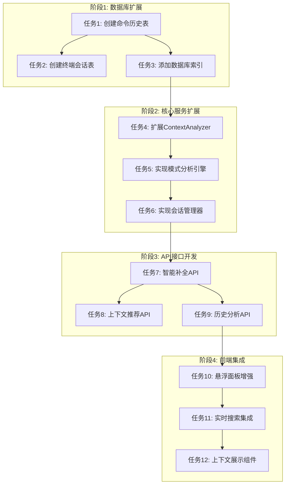

# 📋 智能功能开发 - 原子化任务清单

## 🎯 任务概述
基于<mcfile name="DESIGN_智能功能开发.md" path="/Users/hb/Downloads/快速把命令放入到需要执行的地方/docs/智能功能开发/DESIGN_智能功能开发.md"></mcfile>架构设计，将智能功能开发分解为原子化任务。

## 🔗 任务依赖关系

## 📋 原子任务清单

### 任务1: 创建命令执行历史表
**输入契约**:
- 前置依赖: 现有SQLite数据库结构
- 输入数据: 数据库连接对象
- 环境依赖: SQLite3, 现有app.js数据库初始化函数

**输出契约**:
- 输出数据: command_execution_history表创建成功
- 交付物: 更新的数据库初始化脚本
- 验收标准: 表结构符合设计规范，包含所有必要字段和索引

**实现约束**:
- 技术栈: SQLite3, Node.js
- 接口规范: 与现有categories/commands表保持外键关系
- 质量要求: 包含完整字段定义和索引

**依赖关系**: 无前置依赖，后置任务: 任务2, 任务3

---

### 任务2: 创建终端会话表
**输入契约**:
- 前置依赖: 任务1完成
- 输入数据: 数据库连接对象
- 环境依赖: SQLite3

**输出契约**:
- 输出数据: terminal_sessions表创建成功
- 交付物: 更新的数据库初始化脚本
- 验收标准: 表结构包含会话ID、应用名称、窗口标题、工作目录等字段

**实现约束**:
- 技术栈: SQLite3, Node.js
- 接口规范: 独立表结构，支持会话状态管理
- 质量要求: 包含时间戳字段和必要索引

**依赖关系**: 前置: 任务1, 后置: 任务3

---

### 任务3: 添加数据库索引优化
**输入契约**:
- 前置依赖: 任务1, 任务2完成
- 输入数据: 数据库连接对象
- 环境依赖: SQLite3

**输出契约**:
- 输出数据: 所有必要的索引创建完成
- 交付物: 更新的数据库初始化脚本
- 验收标准: 查询性能优化，包含历史表和时间字段索引

**实现约束**:
- 技术栈: SQLite3, Node.js
- 接口规范: 遵循SQLite索引最佳实践
- 质量要求: 索引覆盖常用查询模式

**依赖关系**: 前置: 任务1, 任务2, 后置: 任务4

---

### 任务4: 扩展ContextAnalyzer类
**输入契约**:
- 前置依赖: 任务3完成
- 输入数据: 现有ContextAnalyzer类代码
- 环境依赖: Node.js, 现有项目依赖

**输出契约**:
- 输出数据: EnhancedContextAnalyzer类实现
- 交付物: 更新的context-analyzer.js文件
- 验收标准: 包含深度上下文分析、文件上下文分析、时间上下文分析方法

**实现约束**:
- 技术栈: JavaScript/Node.js
- 接口规范: 继承现有ContextAnalyzer，保持向后兼容
- 质量要求: 代码风格一致，包含完整注释

**依赖关系**: 前置: 任务3, 后置: 任务5

---

### 任务5: 实现模式分析引擎
**输入契约**:
- 前置依赖: 任务4完成
- 输入数据: 数据库连接，命令历史数据
- 环境依赖: Node.js, SQLite3

**输出契约**:
- 输出数据: PatternAnalysisEngine类实现
- 交付物: 新的pattern-analysis.js文件
- 验收标准: 包含时间模式分析、序列模式分析、频率模式分析方法

**实现约束**:
- 技术栈: JavaScript/Node.js
- 接口规范: 独立类，可通过依赖注入使用
- 质量要求: 算法正确性验证，性能优化

**依赖关系**: 前置: 任务4, 后置: 任务6

---

### 任务6: 实现终端会话管理器
**输入契约**:
- 前置依赖: 任务5完成
- 输入数据: 数据库连接，窗口检测服务
- 环境依赖: Node.js, Electron

**输出契约**:
- 输出数据: TerminalSessionManager类实现
- 交付物: 新的session-manager.js文件
- 验收标准: 包含会话创建、更新、查询功能，支持多终端管理

**实现约束**:
- 技术栈: JavaScript/Node.js, Electron IPC
- 接口规范: 事件驱动架构，支持状态持久化
- 质量要求: 线程安全，内存效率高

**依赖关系**: 前置: 任务5, 后置: 任务7

---

### 任务7: 开发智能补全API
**输入契约**:
- 前置依赖: 任务6完成
- 输入数据: Express.js路由，数据库连接
- 环境依赖: Node.js, Express

**输出契约**:
- 输出数据: /api/autocomplete API端点
- 交付物: 更新的server/routes/commands.js或新路由文件
- 验收标准: 支持查询参数，返回结构化补全建议

**实现约束**:
- 技术栈: Node.js, Express, Joi验证
- 接口规范: RESTful API设计，错误处理完善
- 质量要求: 响应时间 < 100ms

**依赖关系**: 前置: 任务6, 后置: 任务8, 任务10

---

### 任务8: 开发上下文推荐API
**输入契约**:
- 前置依赖: 任务7完成
- 输入数据: Express.js路由，ContextAnalyzer实例
- 环境依赖: Node.js, Express

**输出契约**:
- 输出数据: /api/recommendations API端点
- 交付物: 新的推荐路由文件
- 验收标准: 基于上下文返回个性化命令推荐

**实现约束**:
- 技术栈: Node.js, Express
- 接口规范: RESTful API，支持上下文参数
- 质量要求: 推荐准确性 > 80%

**依赖关系**: 前置: 任务7, 后置: 任务9

---

### 任务9: 开发历史分析API
**输入契约**:
- 前置依赖: 任务8完成
- 输入数据: Express.js路由，PatternAnalysisEngine实例
- 环境依赖: Node.js, Express

**输出契约**:
- 输出数据: /api/analytics/patterns API端点
- 交付物: 新的分析路由文件
- 验收标准: 返回时间模式、频率分析等统计数据

**实现约束**:
- 技术栈: Node.js, Express
- 接口规范: RESTful API，数据聚合接口
- 质量要求: 大数据量处理性能优化

**依赖关系**: 前置: 任务8, 后置: 任务11

---

### 任务10: 增强悬浮命令面板
**输入契约**:
- 前置依赖: 任务7完成
- 输入数据: 现有前端组件代码
- 环境依赖: Electron, HTML/CSS/JS

**输出契约**:
- 输出数据: 支持智能补全的悬浮面板
- 交付物: 更新的前端组件文件
- 验收标准: 实时显示补全建议，支持键盘导航

**实现约束**:
- 技术栈: HTML, CSS, JavaScript
- 接口规范: 与后端API集成，事件处理完善
- 质量要求: 响应式设计，用户体验流畅

**依赖关系**: 前置: 任务7, 后置: 任务12

---

### 任务11: 集成实时搜索服务
**输入契约**:
- 前置依赖: 任务9完成
- 输入数据: 前端搜索组件代码
- 环境依赖: Electron, 前端技术栈

**输出契约**:
- 输出数据: 实时搜索功能实现
- 交付物: 更新的搜索组件文件
- 验收标准: 输入时实时返回搜索结果，性能优化

**实现约束**:
- 技术栈: JavaScript, 前端框架
- 接口规范: 防抖处理，API调用优化
- 质量要求: 搜索延迟 < 200ms

**依赖关系**: 前置: 任务9, 后置: 任务12

---

### 任务12: 开发上下文展示组件
**输入契约**:
- 前置依赖: 任务10, 任务11完成
- 输入数据: 前端UI组件代码
- 环境依赖: Electron, 前端技术栈

**输出契约**:
- 输出数据: 上下文信息展示组件
- 交付物: 新的React/Vue组件文件
- 验收标准: 显示当前上下文信息，命令推荐理由

**实现约束**:
- 技术栈: 前端框架(React/Vue)
- 接口规范: 组件化设计，状态管理
- 质量要求: UI美观，信息清晰

**依赖关系**: 前置: 任务10, 任务11

---

## 🚀 执行顺序建议

### 推荐执行顺序:
1. **阶段1**: 任务1 → 任务2 → 任务3 (数据库基础)
2. **阶段2**: 任务4 → 任务5 → 任务6 (核心服务)
3. **阶段3**: 任务7 → 任务8 → 任务9 (后端API)
4. **阶段4**: 任务10 → 任务11 → 任务12 (前端集成)

### 并行任务:
- 任务7, 任务8, 任务9 可并行开发(不同API端点)
- 任务10, 任务11 可并行开发(不同前端功能)

## ✅ 验收检查清单

- [ ] 所有数据库表结构符合设计规范
- [ ] API接口响应时间达标
- [ ] 前端组件用户体验流畅
- [ ] 错误处理完善，日志记录完整
- [ ] 代码风格与现有项目一致
- [ ] 单元测试覆盖率 > 80%
- [ ] 集成测试通过
- [ ] 文档更新完整

## 📊 复杂度评估

| 任务 | 复杂度 | 预计工时 | 风险等级 |
|------|--------|----------|----------|
| 任务1-3 | 低 | 2小时 | 低 |
| 任务4-6 | 中 | 4小时 | 中 |
| 任务7-9 | 中 | 6小时 | 中 |
| 任务10-12 | 高 | 8小时 | 高 |

**总预计**: 20小时开发时间

---
**📅 创建时间**: 2024年
**✅ 下一步**: 等待审批后开始按阶段执行