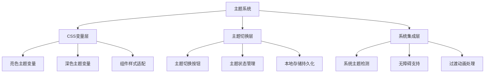
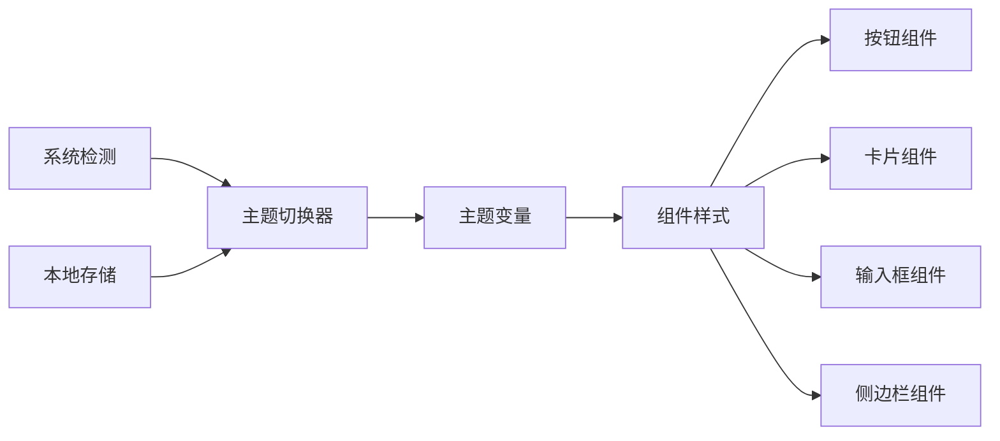
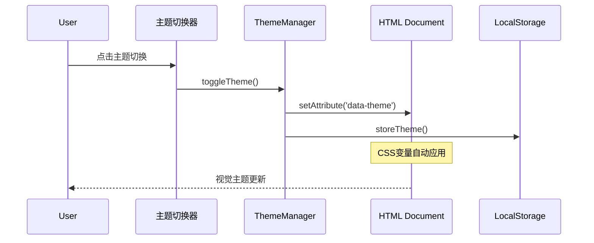

# DESIGN_深色主题实现.md

## 整体架构设计

### 架构图


## 分层设计

### 1. CSS变量层
**核心组件**: 主题变量定义系统

```css
/* 亮色主题 (默认) */
:root {
  --color-scheme: light;
  /* 现有变量保持不变 */
}

/* 深色主题 */
[data-theme="dark"] {
  --color-scheme: dark;
  
  /* 颜色反转 */
  --bg-primary: #1a1a1a;
  --bg-secondary: #2d2d2d;
  --bg-muted: #3d3d3d;
  
  --text-primary: #ffffff;
  --text-secondary: #a0a0a0;
  --text-muted: #666666;
  
  --border-primary: #404040;
  --border-secondary: #505050;
  
  /* 深色主题特定调整 */
  --shadow-sm: 0 1px 3px rgba(0, 0, 0, 0.3);
  --shadow-md: 0 4px 6px rgba(0, 0, 0, 0.4);
  --shadow-lg: 0 10px 15px rgba(0, 0, 0, 0.5);
}
```

### 2. 主题切换层
**核心组件**: 主题状态管理

```javascript
class ThemeManager {
  constructor() {
    this.currentTheme = this.getStoredTheme() || this.getSystemTheme();
    this.applyTheme(this.currentTheme);
  }
  
  toggleTheme() {
    this.currentTheme = this.currentTheme === 'dark' ? 'light' : 'dark';
    this.applyTheme(this.currentTheme);
    this.storeTheme(this.currentTheme);
  }
  
  applyTheme(theme) {
    document.documentElement.setAttribute('data-theme', theme);
  }
}
```

### 3. 系统集成层
**核心组件**: 系统主题检测与无障碍支持

```javascript
// 系统主题检测
const systemThemeMedia = window.matchMedia('(prefers-color-scheme: dark)');

systemThemeMedia.addEventListener('change', (e) => {
  if (!this.hasUserOverride()) {
    this.applyTheme(e.matches ? 'dark' : 'light');
  }
});
```

## 模块依赖关系



## 接口契约定义

### 主题管理器接口
```typescript
interface ThemeManager {
  currentTheme: 'light' | 'dark' | 'auto';
  toggleTheme(): void;
  applyTheme(theme: string): void;
  getSystemTheme(): 'light' | 'dark';
  storeTheme(theme: string): void;
  getStoredTheme(): string | null;
  hasUserOverride(): boolean;
}
```

### CSS变量接口
```css
/**
 * 主题变量约定:
 * - 所有颜色变量必须同时定义亮色和深色版本
 * - 变量命名保持语义化
 * - 确保足够的颜色对比度
 */
```

## 数据流向图



## 异常处理策略

### 1. 主题加载失败
- 回退到系统主题检测
- 确保基本可访问性

### 2. 存储失败
- 使用内存状态保持会话内一致性
- 优雅降级处理

### 3. 浏览器兼容性
- 检测CSS变量支持
- 提供降级方案

## 设计原则

1. **渐进增强**: 优先支持现代浏览器特性
2. **优雅降级**: 确保在不支持的情况下基本功能正常
3. **性能优先**: 主题切换应快速无闪烁
4. **可访问性**: 满足WCAG 2.1对比度要求
5. **一致性**: 保持与现有设计系统的一致性

## 验收标准

- [ ] 亮色/深色主题切换功能正常
- [ ] 系统主题自动检测工作正常
- [ ] 主题选择持久化存储
- [ ] 所有组件在深色主题下显示正常
- [ ] 文本对比度符合WCAG AA标准
- [ ] 主题切换过渡动画平滑
- [ ] 无障碍支持完整