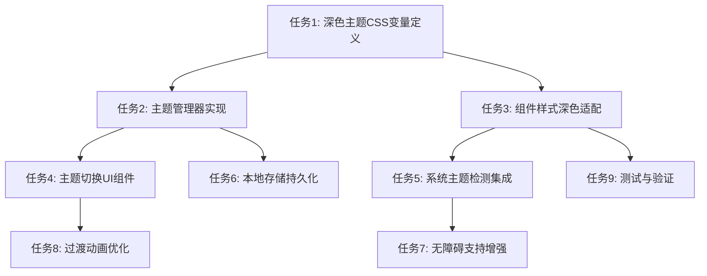

# TASK_深色主题实现.md

## 任务依赖关系图

## 原子任务清单

### 任务1: 深色主题CSS变量定义
**输入契约**:
- 现有亮色主题CSS变量定义
- 设计规范中的颜色对比度要求

**输出契约**:
- 完整的深色主题CSS变量系统
- 确保与现有变量命名一致

**实现约束**:
- 使用CSS自定义属性语法
- 保持变量命名语义化
- 确保颜色对比度 ≥ 4.5:1 (WCAG AA)

**依赖关系**: 无

### 任务2: 主题管理器实现
**输入契约**:
- 深色主题CSS变量定义
- 浏览器本地存储API

**输出契约**:
- ThemeManager类实现
- 主题状态管理功能

**实现约束**:
- 使用ES6 class语法
- 支持主题切换、应用、存储功能
- 错误处理机制

**依赖关系**: 任务1

### 任务3: 组件样式深色适配
**输入契约**:
- 深色主题CSS变量
- 现有组件样式定义

**输出契约**:
- 所有组件在深色主题下的适配样式
- 特殊组件的深色主题优化

**实现约束**:
- 保持组件样式一致性
- 处理图片和图标的深色适配
- 确保视觉层次清晰

**依赖关系**: 任务1

### 任务4: 主题切换UI组件
**输入契约**:
- ThemeManager实例
- 设计规范中的UI要求

**输出契约**:
- 主题切换按钮组件
- 视觉状态反馈

**实现约束**:
- 响应式设计
- 无障碍访问支持
- 视觉反馈明确

**依赖关系**: 任务2

### 任务5: 系统主题检测集成
**输入契约**:
- matchMedia API
- 系统主题变更事件

**输出契约**:
- 系统主题自动检测功能
- 主题变更事件处理

**实现约束**:
- 浏览器兼容性处理
- 用户手动选择的优先级

**依赖关系**: 任务2

### 任务6: 本地存储持久化
**输入契约**:
- localStorage API
- 用户主题偏好

**输出契约**:
- 主题选择的持久化存储
- 存储异常处理

**实现约束**:
- 数据序列化处理
- 存储空间限制处理

**依赖关系**: 任务2

### 任务7: 无障碍支持增强
**输入契约**:
- WCAG 2.1规范
- 屏幕阅读器兼容性要求

**输出契约**:
- ARIA标签支持
- 键盘导航支持
- 高对比度模式兼容

**实现约束**:
- 遵循WAI-ARIA规范
- 测试主流屏幕阅读器

**依赖关系**: 任务3

### 任务8: 过渡动画优化
**输入契约**:
- CSS过渡动画系统
- 主题切换性能要求

**输出契约**:
- 平滑的主题切换过渡效果
- 性能优化的动画实现

**实现约束**:
- 使用CSS transitions
- 避免布局抖动
- 60fps流畅度

**依赖关系**: 任务4

### 任务9: 测试与验证
**输入契约**:
- 所有实现的功能模块
- 测试用例规范

**输出契约**:
- 功能测试报告
- 性能测试结果
- 无障碍测试验证

**实现约束**:
- 跨浏览器测试
- 移动端适配测试
- 性能基准测试

**依赖关系**: 任务1-8

## 复杂度评估

| 任务 | 复杂度 | 预计工时 | 风险等级 |
|------|--------|----------|----------|
| 任务1 | 中等 | 2小时 | 低 |
| 任务2 | 中等 | 3小时 | 中 |
| 任务3 | 高 | 4小时 | 中 |
| 任务4 | 低 | 1小时 | 低 |
| 任务5 | 低 | 1小时 | 低 |
| 任务6 | 低 | 1小时 | 低 |
| 任务7 | 中等 | 2小时 | 中 |
| 任务8 | 低 | 1小时 | 低 |
| 任务9 | 高 | 3小时 | 中 |

## 验收标准

每个任务完成后必须验证：
1. 功能实现符合设计规范
2. 代码质量符合项目标准
3. 性能指标达到要求
4. 浏览器兼容性满足要求
5. 无障碍支持完整

## 风险控制

- **技术风险**: CSS变量浏览器兼容性
- **设计风险**: 颜色对比度不足
- **实现风险**: 主题切换性能问题
- **测试风险**: 跨浏览器测试覆盖不全

应对策略：
- 使用特性检测和降级方案
- 使用工具验证颜色对比度
- 优化CSS选择器性能
- 建立完整的测试矩阵