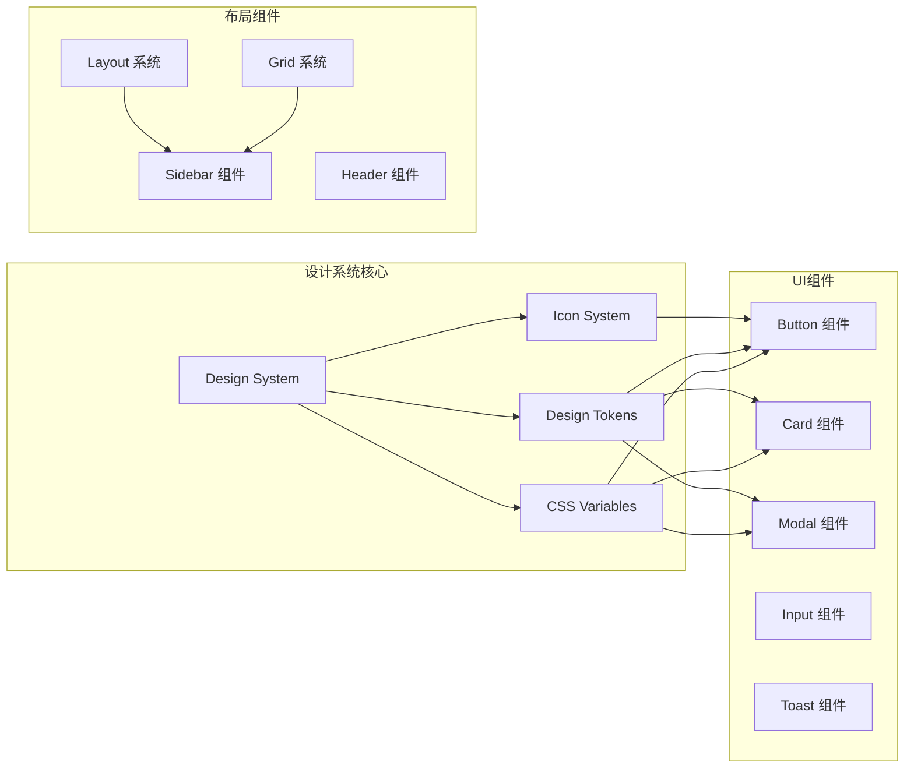
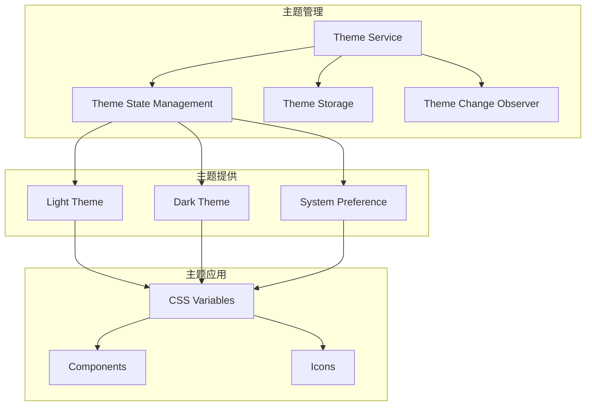
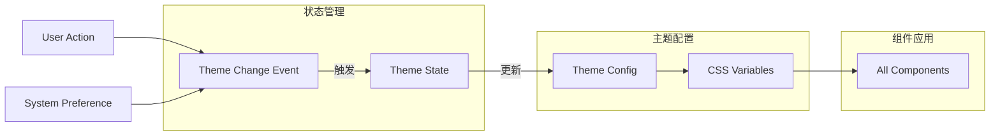
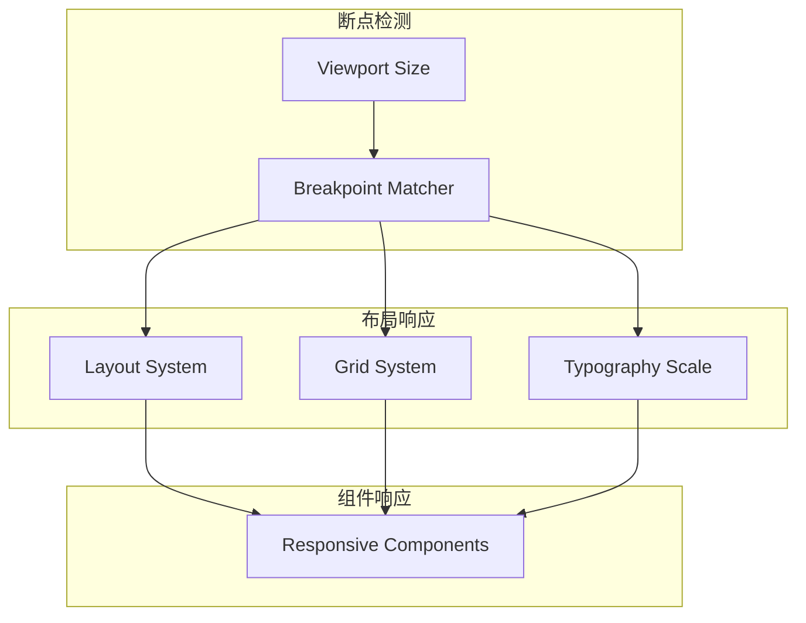

# DESIGN - Command Manager 视觉与用户体验优化

## 🏗️ 整体架构设计

### 系统分层架构
```mermaid
graph TB
    subgraph "表现层 (Presentation Layer)"
        A[设计系统 Design System] --> B[组件库 Components]
        B --> C[主题系统 Themes]
    end
    
    subgraph "应用层 (Application Layer)"
        D[主界面 Main App] --> E[悬浮面板 Floating Panel]
        D --> F[模态框 Modals]
    end
    
    subgraph "服务层 (Service Layer)
        G[样式服务 CSS Variables]
        H[图标服务 Icon Service]
        I[主题服务 Theme Service]
    end
    
    A --> G
    B --> H
    C --> I
    
    G --> D
    H --> D
    I --> D
    
    G --> E
    H --> E
    I --> E
```

### 核心组件架构


## 🎨 设计系统规范

### 1. 色彩系统 (Color System)

#### 主色调 (Primary Colors)
```css
:root {
  /* 蓝色系 - 主品牌色 */
  --color-primary-50: #eff6ff;
  --color-primary-100: #dbeafe;
  --color-primary-200: #bfdbfe;
  --color-primary-300: #93c5fd;
  --color-primary-400: #60a5fa;
  --color-primary-500: #3b82f6; /* 主色 */
  --color-primary-600: #2563eb;
  --color-primary-700: #1d4ed8;
  --color-primary-800: #1e40af;
  --color-primary-900: #1e3a8a;
  
  /* 灰色系 - 中性色 */
  --color-gray-50: #f9fafb;
  --color-gray-100: #f3f4f6;
  --color-gray-200: #e5e7eb;
  --color-gray-300: #d1d5db;
  --color-gray-400: #9ca3af;
  --color-gray-500: #6b7280;
  --color-gray-600: #4b5563;
  --color-gray-700: #374151;
  --color-gray-800: #1f2937;
  --color-gray-900: #111827;
}
```

#### 功能色 (Functional Colors)
```css
:root {
  /* 成功色 */
  --color-success-50: #ecfdf5;
  --color-success-500: #10b981;
  --color-success-600: #059669;
  
  /* 警告色 */
  --color-warning-50: #fffbeb;
  --color-warning-500: #f59e0b;
  --color-warning-600: #d97706;
  
  /* 错误色 */
  --color-error-50: #fef2f2;
  --color-error-500: #ef4444;
  --color-error-600: #dc2626;
  
  /* 信息色 */
  --color-info-50: #eff6ff;
  --color-info-500: #3b82f6;
  --color-info-600: #2563eb;
}
```

### 2. 排版系统 (Typography)

#### 字体尺度
```css
:root {
  --font-size-xs: 12px;
  --font-size-sm: 14px;
  --font-size-base: 16px;
  --font-size-lg: 18px;
  --font-size-xl: 20px;
  --font-size-2xl: 24px;
  --font-size-3xl: 30px;
  
  --font-weight-normal: 400;
  --font-weight-medium: 500;
  --font-weight-semibold: 600;
  --font-weight-bold: 700;
  
  --line-height-tight: 1.25;
  --line-height-normal: 1.5;
  --line-height-relaxed: 1.75;
}
```

#### 字体应用
```css
.text-xs { font-size: var(--font-size-xs); line-height: var(--line-height-tight); }
.text-sm { font-size: var(--font-size-sm); line-height: var(--line-height-tight); }
.text-base { font-size: var(--font-size-base); line-height: var(--line-height-normal); }
.text-lg { font-size: var(--font-size-lg); line-height: var(--line-height-normal); }
.text-xl { font-size: var(--font-size-xl); line-height: var(--line-height-normal); }
.text-2xl { font-size: var(--font-size-2xl); line-height: var(--line-height-tight); }
.text-3xl { font-size: var(--font-size-3xl); line-height: var(--line-height-tight); }
```

### 3. 间距系统 (Spacing)
```css
:root {
  --space-0: 0;
  --space-1: 4px;
  --space-2: 8px;
  --space-3: 12px;
  --space-4: 16px;
  --space-5: 20px;
  --space-6: 24px;
  --space-8: 32px;
  --space-10: 40px;
  --space-12: 48px;
  --space-16: 64px;
  --space-20: 80px;
  --space-24: 96px;
  --space-32: 128px;
}
```

### 4. 圆角系统 (Border Radius)
```css
:root {
  --radius-none: 0;
  --radius-sm: 4px;
  --radius: 8px;
  --radius-md: 8px;
  --radius-lg: 12px;
  --radius-xl: 16px;
  --radius-2xl: 24px;
  --radius-full: 9999px;
}
```

### 5. 阴影系统 (Shadows)
```css
:root {
  --shadow-sm: 0 1px 2px 0 rgba(0, 0, 0, 0.05);
  --shadow: 0 1px 3px 0 rgba(0, 0, 0, 0.1), 0 1px 2px 0 rgba(0, 0, 0, 0.06);
  --shadow-md: 0 4px 6px -1px rgba(0, 0, 0, 0.1), 0 2px 4px -1px rgba(0, 0, 0, 0.06);
  --shadow-lg: 0 10px 15px -3px rgba(0, 0, 0, 0.1), 0 4px 6px -2px rgba(0, 0, 0, 0.05);
  --shadow-xl: 0 20px 25px -5px rgba(0, 0, 0, 0.1), 0 10px 10px -5px rgba(0, 0, 0, 0.04);
  --shadow-2xl: 0 25px 50px -12px rgba(0, 0, 0, 0.25);
  --shadow-inner: inset 0 2px 4px 0 rgba(0, 0, 0, 0.06);
}
```

## 🔧 核心组件设计

### 1. Button 组件规范
```css
.btn {
  display: inline-flex;
  align-items: center;
  justify-content: center;
  border: 1px solid transparent;
  border-radius: var(--radius);
  font-weight: var(--font-weight-medium);
  font-size: var(--font-size-sm);
  line-height: var(--line-height-normal);
  padding: var(--space-2) var(--space-4);
  transition: all var(--transition-normal) var(--ease-in-out);
  cursor: pointer;
  user-select: none;
}

.btn-primary {
  background-color: var(--color-primary-500);
  color: white;
}

.btn-primary:hover {
  background-color: var(--color-primary-600);
}

.btn-primary:active {
  background-color: var(--color-primary-700);
}
```

### 2. Card 组件规范
```css
.card {
  background: var(--color-background);
  border: 1px solid var(--color-border);
  border-radius: var(--radius-lg);
  box-shadow: var(--shadow-sm);
  padding: var(--space-6);
  transition: box-shadow var(--transition-normal) var(--ease-in-out);
}

.card:hover {
  box-shadow: var(--shadow-md);
}

.card-header {
  padding-bottom: var(--space-4);
  margin-bottom: var(--space-4);
  border-bottom: 1px solid var(--color-border);
}

.card-body {
  color: var(--color-text-secondary);
}
```

### 3. Input 组件规范
```css
.input {
  width: 100%;
  border: 1px solid var(--color-border);
  border-radius: var(--radius);
  padding: var(--space-2) var(--space-3);
  font-size: var(--font-size-sm);
  line-height: var(--line-height-normal);
  transition: all var(--transition-normal) var(--ease-in-out);
  background: var(--color-background);
}

.input:focus {
  outline: none;
  border-color: var(--color-primary-500);
  box-shadow: 0 0 0 3px rgba(59, 130, 246, 0.1);
}

.input::placeholder {
  color: var(--color-text-tertiary);
}
```

## 🎭 主题系统设计

### 主题切换架构


### 深色主题配置
```css
[data-theme="dark"] {
  --color-background: var(--color-gray-900);
  --color-surface: var(--color-gray-800);
  --color-border: var(--color-gray-700);
  --color-divider: var(--color-gray-600);
  
  --color-text-primary: var(--color-gray-50);
  --color-text-secondary: var(--color-gray-300);
  --color-text-tertiary: var(--color-gray-400);
  --color-text-inverse: var(--color-gray-900);
  
  --shadow-sm: 0 1px 2px 0 rgba(0, 0, 0, 0.3);
  --shadow-md: 0 4px 6px -1px rgba(0, 0, 0, 0.3), 0 2px 4px -1px rgba(0, 0, 0, 0.2);
  --shadow-lg: 0 10px 15px -3px rgba(0, 0, 0, 0.3), 0 4px 6px -2px rgba(0, 0, 0, 0.2);
}
```

## 📱 响应式设计

### 断点系统
```css
/* 移动设备优先策略 */
.container {
  width: 100%;
  padding: var(--space-4);
}

/* 小屏 (≥640px) */
@media (min-width: 640px) {
  .container {
    max-width: 640px;
    padding: var(--space-6);
  }
}

/* 中屏 (≥768px) */
@media (min-width: 768px) {
  .container {
    max-width: 768px;
  }
}

/* 大屏 (≥1024px) */
@media (min-width: 1024px) {
  .container {
    max-width: 1024px;
    padding: var(--space-8);
  }
}

/* 超大屏 (≥1280px) */
@media (min-width: 1280px) {
  .container {
    max-width: 1280px;
  }
}
```

### 网格系统
```css
.grid {
  display: grid;
  gap: var(--space-6);
  grid-template-columns: repeat(1, minmax(0, 1fr));
}

/* 响应式列数 */
@media (min-width: 640px) {
  .grid {
    grid-template-columns: repeat(2, minmax(0, 1fr));
  }
}

@media (min-width: 768px) {
  .grid {
    grid-template-columns: repeat(3, minmax(0, 1fr));
  }
}

@media (min-width: 1024px) {
  .grid {
    grid-template-columns: repeat(4, minmax(0, 1fr));
  }
}
```

## 🎯 交互设计

### 动画规范
```css
:root {
  --transition-fast: 150ms;
  --transition-normal: 250ms;
  --transition-slow: 350ms;
  
  --ease-in: cubic-bezier(0.4, 0, 1, 1);
  --ease-out: cubic-bezier(0, 0, 0.2, 1);
  --ease-in-out: cubic-bezier(0.4, 0, 0.2, 1);
}

/* 悬停效果 */
.hover-lift {
  transition: transform var(--transition-normal) var(--ease-out);
}

.hover-lift:hover {
  transform: translateY(-2px);
}

/* 聚焦效果 */
.focus-ring {
  transition: box-shadow var(--transition-fast) var(--ease-out);
}

.focus-ring:focus {
  outline: none;
  box-shadow: 0 0 0 3px rgba(59, 130, 246, 0.1);
}
```

### 微交互设计
1. **按钮点击**: 轻微缩放效果 (scale: 0.98)
2. **卡片悬停**: 轻微上浮和阴影增强
3. **输入聚焦**: 边框颜色变化和发光效果
4. **切换动画**: 平滑的过渡和状态变化
5. **加载状态**: 骨架屏和进度指示

## 🔄 数据流向设计

### CSS变量数据流


### 响应式数据流


## 🛡️ 异常处理策略

### 样式降级策略
1. **CSS变量降级**: 提供默认值回退
2. **特性检测**: 使用@supports进行特性检测
3. **渐进增强**: 基础功能保证，增强功能可选

### 错误边界
1. **主题加载错误**: 回退到默认主题
2. **图标加载失败**: 显示备用文本或简单图标
3. **样式冲突**: 使用CSS specificity和隔离策略

## 📊 性能优化策略

### CSS性能
1. **变量优化**: 减少CSS变量数量
2. **选择器优化**: 避免深层嵌套选择器
3. **动画性能**: 使用transform和opacity
4. **加载策略**: 关键CSS内联，非关键CSS异步

### JavaScript性能
1. **事件委托**: 减少事件监听器数量
2. **防抖节流**: 搜索和滚动事件优化
3. **内存管理**: 及时清理不再使用的样式
4. **懒加载**: 非首屏资源延迟加载

---

**设计状态**: ✅ 架构设计完成，组件规范明确，可以进入Atomize阶段

下一步：创建TASK文档，拆分子任务和明确接口规范