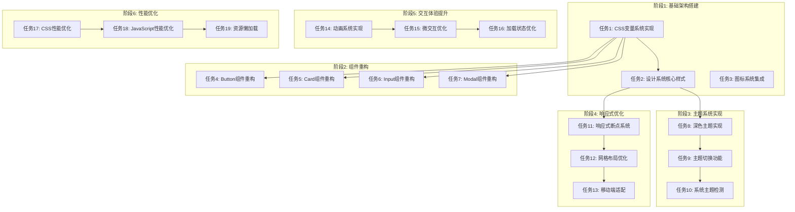

# TASK - Command Manager 视觉与用户体验优化

## 📋 任务依赖关系图

## 🎯 原子任务清单

### 任务1: CSS变量系统实现
**输入契约**:
- 现有项目结构分析完成
- 设计系统色彩规范已定义
- 需要替换的内联样式已识别

**输出契约**:
- 完整的CSS变量定义在 :root 中
- 所有现有样式迁移到使用CSS变量
- 提供变量降级策略

**实现约束**:
- 使用CSS自定义属性语法
- 保持与现有样式兼容
- 变量命名遵循BEM规范

**依赖关系**: 无前置依赖

---

### 任务2: 设计系统核心样式
**输入契约**:
- CSS变量系统已实现
- 排版、间距、圆角规范已定义

**输出契约**:
- 完整的排版系统类
- 间距工具类系统
- 圆角工具类系统
- 阴影工具类系统

**实现约束**:
- 使用Tailwind-like工具类命名
- 支持响应式变体
- 保持样式特异性可控

**依赖关系**: 任务1完成

---

### 任务3: 图标系统集成
**输入契约**:
- 现有SVG图标文件位置
- 图标使用方式分析完成

**输出契约**:
- 统一的图标组件系统
- SVG图标优化和标准化
- 图标颜色使用CSS变量

**实现约束**:
- 支持动态颜色切换
- 提供尺寸变体
- 保持SVG可访问性

**依赖关系**: 任务1完成

---

### 任务4: Button组件重构
**输入契约**:
- CSS变量系统可用
- 设计系统核心样式可用
- 现有按钮样式分析完成

**输出契约**:
- 统一的Button组件样式
- 支持多种变体 (primary, secondary, etc.)
- 完整的交互状态样式
- 响应式尺寸支持

**实现约束**:
- 保持现有功能不变
- 提供平滑的过渡动画
- 支持禁用状态

**依赖关系**: 任务1, 任务2完成

---

### 任务5: Card组件重构
**输入契约**:
- CSS变量系统可用
- 设计系统核心样式可用
- 现有卡片样式分析完成

**输出契约**:
- 统一的Card组件样式
- 支持多种变体
- 悬停和焦点状态
- 响应式布局

**实现约束**:
- 保持内容结构兼容
- 提供一致的阴影效果
- 支持嵌套使用

**依赖关系**: 任务1, 任务2完成

---

### 任务6: Input组件重构
**输入契约**:
- CSS变量系统可用
- 设计系统核心样式可用
- 现有输入框样式分析完成

**输出契约**:
- 统一的Input组件样式
- 完整的交互状态
- 错误状态样式
- 成功状态样式

**实现约束**:
- 保持表单功能完整
- 提供占位符样式
- 支持各种输入类型

**依赖关系**: 任务1, 任务2完成

---

### 任务7: Modal组件重构
**输入契约**:
- CSS变量系统可用
- 设计系统核心样式可用
- 现有模态框分析完成

**输出契约**:
- 统一的Modal组件样式
- 平滑的打开/关闭动画
- 响应式尺寸调整
- 背景遮罩优化

**实现约束**:
- 保持现有JavaScript交互
- 提供无障碍支持
- 支持多种尺寸

**依赖关系**: 任务1, 任务2完成

---

### 任务8: 深色主题实现
**输入契约**:
- CSS变量系统可用
- 设计系统核心样式可用

**输出契约**:
- 完整的深色主题变量定义
- 所有组件深色模式支持
- 主题切换的基础结构

**实现约束**:
- 使用data-theme属性切换
- 提供完整的颜色对比度
- 保持视觉层次清晰

**依赖关系**: 任务1, 任务2完成

---

### 任务9: 主题切换功能
**输入契约**:
- 深色主题实现完成
- 现有用户设置存储机制

**输出契约**:
- 主题切换用户界面
- 主题状态持久化存储
- 实时主题切换功能

**实现约束**:
- 使用localStorage存储偏好
- 提供平滑的主题过渡
- 支持系统主题检测

**依赖关系**: 任务8完成

---

### 任务10: 系统主题检测
**输入契约**:
- 主题切换功能可用
- 浏览器主题检测API支持

**输出契约**:
- 自动检测系统主题偏好
- 响应系统主题变化
- 提供手动覆盖选项

**实现约束**:
- 使用prefers-color-scheme
- 处理浏览器兼容性
- 提供用户控制权

**依赖关系**: 任务9完成

---

### 任务11: 响应式断点系统
**输入契约**:
- 设计系统断点规范已定义
- 现有布局结构分析完成

**输出契约**:
- 完整的响应式断点定义
- 媒体查询工具类
- 断点检测JavaScript

**实现约束**:
- 使用移动优先策略
- 提供常用的断点变体
- 保持断点一致性

**依赖关系**: 任务2完成

---

### 任务12: 网格布局优化
**输入契约**:
- 响应式断点系统可用
- 现有网格布局分析完成

**输出契约**:
- 统一的网格系统
- 响应式列数调整
- 间距和间隙控制

**实现约束**:
- 使用CSS Grid布局
- 支持各种内容类型
- 提供布局工具类

**依赖关系**: 任务11完成

---

### 任务13: 移动端适配
**输入契约**:
- 响应式系统完整
- 移动端用户体验分析

**输出契约**:
- 移动端优化的布局
- 触摸友好的交互
- 移动端特定样式

**实现约束**:
- 支持各种移动设备
- 优化触摸目标尺寸
- 处理移动端视口

**依赖关系**: 任务11, 任务12完成

---

### 任务14: 动画系统实现
**输入契约**:
- CSS变量系统可用
- 现有交互分析完成

**输出契约**:
- 统一的动画时长变量
- 缓动函数定义
- 常用动画工具类

**实现约束**:
- 使用CSS transitions
- 提供性能优化的动画
- 支持自定义缓动

**依赖关系**: 任务1完成

---

### 任务15: 微交互优化
**输入契约**:
- 动画系统可用
- 用户交互热点分析

**输出契约**:
- 按钮点击反馈动画
- 卡片悬停效果
- 输入聚焦效果
- 切换过渡动画

**实现约束**:
- 保持动画轻量自然
- 提供一致的交互模式
- 优化性能表现

**依赖关系**: 任务14完成

---

### 任务16: 加载状态优化
**输入契约**:
- 动画系统可用
- 现有加载状态分析

**输出契约**:
- 骨架屏加载效果
- 进度指示组件
- 加载状态过渡

**实现约束**:
- 提供平滑的加载体验
- 支持各种内容类型
- 优化加载性能

**依赖关系**: 任务14, 任务15完成

---

### 任务17: CSS性能优化
**输入契约**:
- 所有样式重构完成
- 性能瓶颈分析

**输出契约**:
- 优化的CSS选择器
- 减少的样式重复
- 改进的渲染性能

**实现约束**:
- 使用高效的选择器
- 减少CSS变量数量
- 优化动画性能

**依赖关系**: 所有样式相关任务完成

---

### 任务18: JavaScript性能优化
**输入契约**:
- 所有功能实现完成
- 性能分析完成

**输出契约**:
- 优化的事件处理
- 防抖和节流实现
- 内存泄漏修复

**实现约束**:
- 使用事件委托
- 优化DOM操作
- 改进资源管理

**依赖关系**: 所有功能任务完成

---

### 任务19: 资源懒加载
**输入契约**:
- 性能优化完成
- 资源使用分析

**输出契约**:
- 非关键CSS异步加载
- 图片懒加载实现
- 组件懒加载支持

**实现约束**:
- 使用Intersection Observer
- 保持功能完整性
- 提供加载回退

**依赖关系**: 任务17, 任务18完成

## ✅ 验收标准

### 整体验收
- [ ] 所有视觉样式统一使用CSS变量
- [ ] 设计系统规范完全实施
- [ ] 深色主题功能正常工作
- [ ] 响应式布局在所有断点正确显示
- [ ] 交互动画流畅自然
- [ ] 性能指标达到预期
- [ ] 无障碍支持完善
- [ ] 与现有功能完全兼容

### 质量指标
- **代码质量**: 遵循现有代码规范，样式特异性可控
- **测试质量**: 视觉回归测试通过，跨浏览器测试通过
- **文档质量**: 所有新功能都有相应文档
- **性能质量**: 加载时间优化，运行时性能提升

## 🚨 风险控制

### 技术风险
1. **CSS变量浏览器兼容性**: 提供降级方案，支持主流浏览器
2. **主题切换性能**: 优化重绘和回流，使用will-change
3. **移动端兼容性**: 充分测试各种移动设备和浏览器

### 实施风险
1. **现有功能破坏**: 逐步替换，充分测试
2. **用户体验不一致**: 建立设计系统规范，严格执行
3. **性能回归**: 持续性能监控和优化

## 📊 进度跟踪

| 阶段 | 任务 | 状态 | 开始时间 | 完成时间 | 负责人 |
|------|------|------|----------|----------|--------|
| 1 | CSS变量系统实现 | ⏳待开始 | - | - | AI |
| 1 | 设计系统核心样式 | ⏳待开始 | - | - | AI |
| 1 | 图标系统集成 | ⏳待开始 | - | - | AI |
| 2 | Button组件重构 | ⏳待开始 | - | - | AI |
| 2 | Card组件重构 | ⏳待开始 | - | - | AI |
| 2 | Input组件重构 | ⏳待开始 | - | - | AI |
| 2 | Modal组件重构 | ⏳待开始 | - | - | AI |
| 3 | 深色主题实现 | ⏳待开始 | - | - | AI |
| 3 | 主题切换功能 | ⏳待开始 | - | - | AI |
| 3 | 系统主题检测 | ⏳待开始 | - | - | AI |
| 4 | 响应式断点系统 | ⏳待开始 | - | - | AI |
| 4 | 网格布局优化 | ⏳待开始 | - | - | AI |
| 4 | 移动端适配 | ⏳待开始 | - | - | AI |
| 5 | 动画系统实现 | ⏳待开始 | - | - | AI |
| 5 | 微交互优化 | ⏳待开始 | - | - | AI |
| 5 | 加载状态优化 | ⏳待开始 | - | - | AI |
| 6 | CSS性能优化 | ⏳待开始 | - | - | AI |
| 6 | JavaScript性能优化 | ⏳待开始 | - | - | AI |
| 6 | 资源懒加载 | ⏳待开始 | - | - | AI |

**当前状态**: ✅ 任务拆分完成，可以进入Approve阶段审批

下一步：等待人工审批任务计划，确认后开始实施